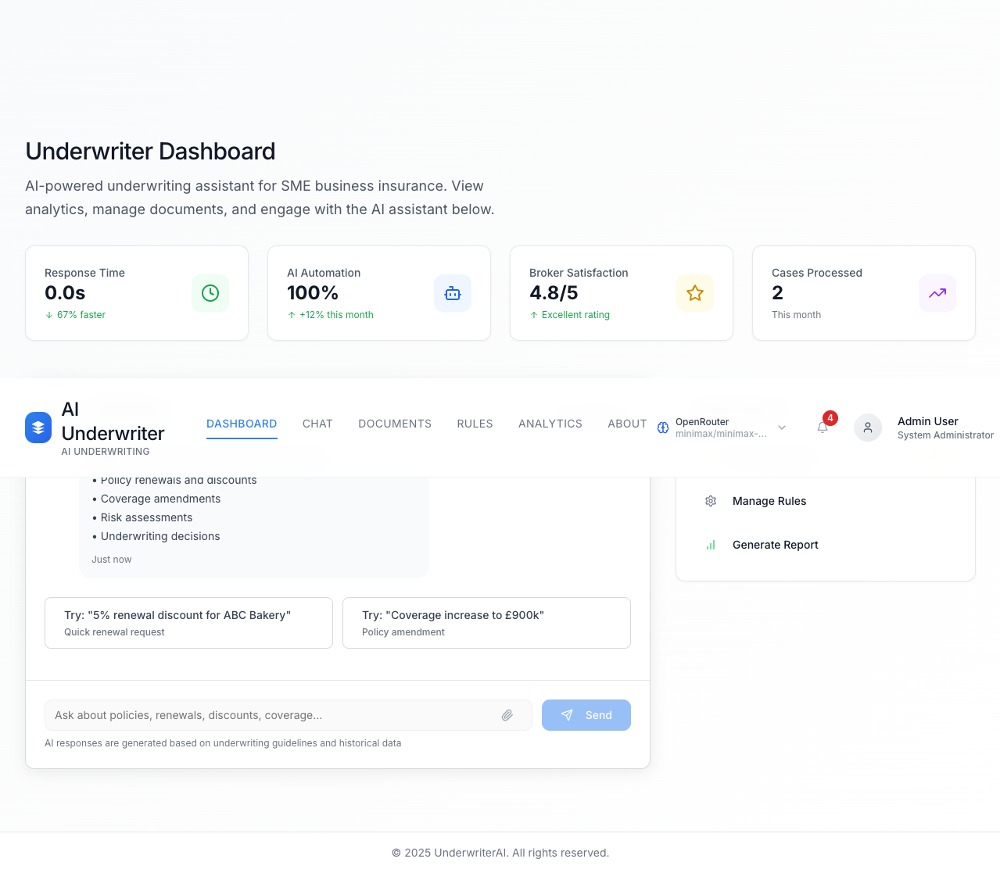
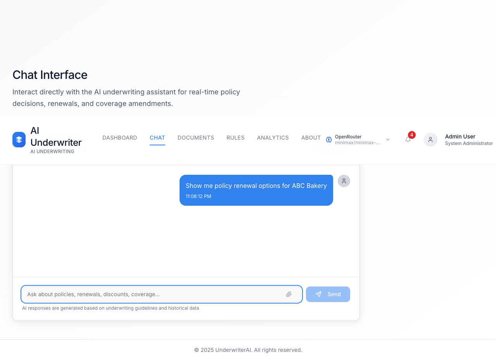
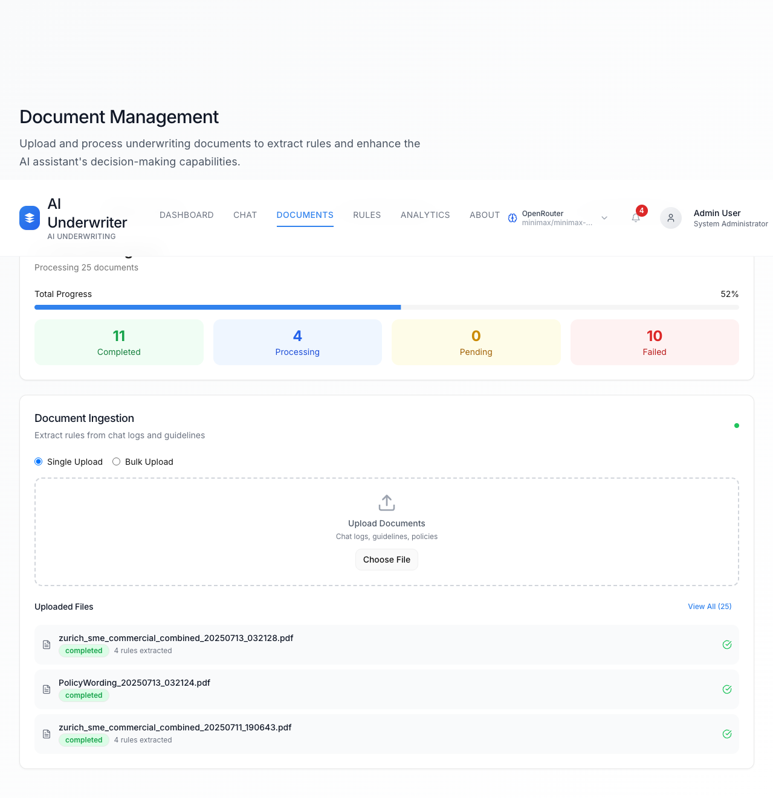
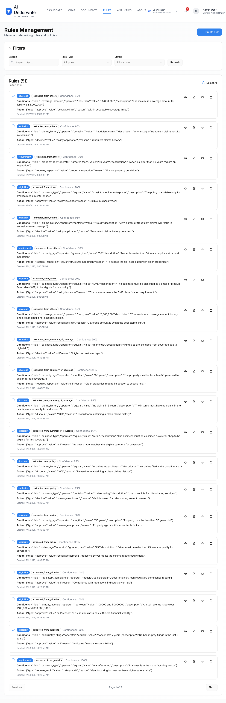
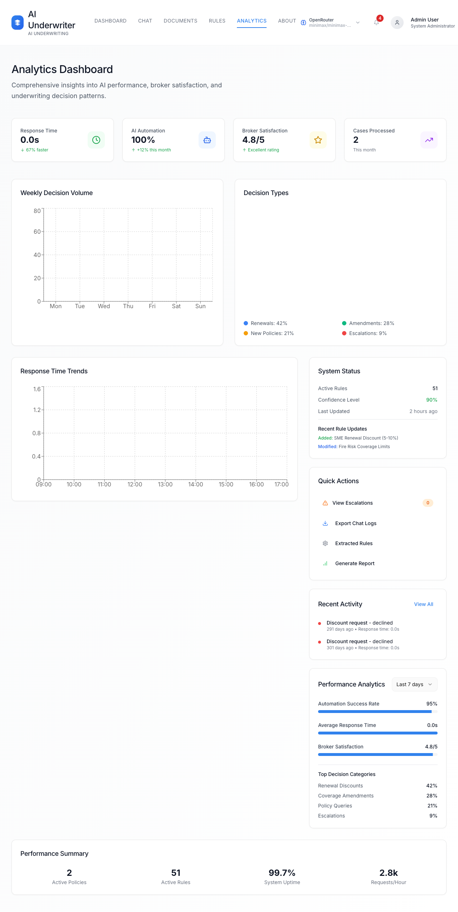
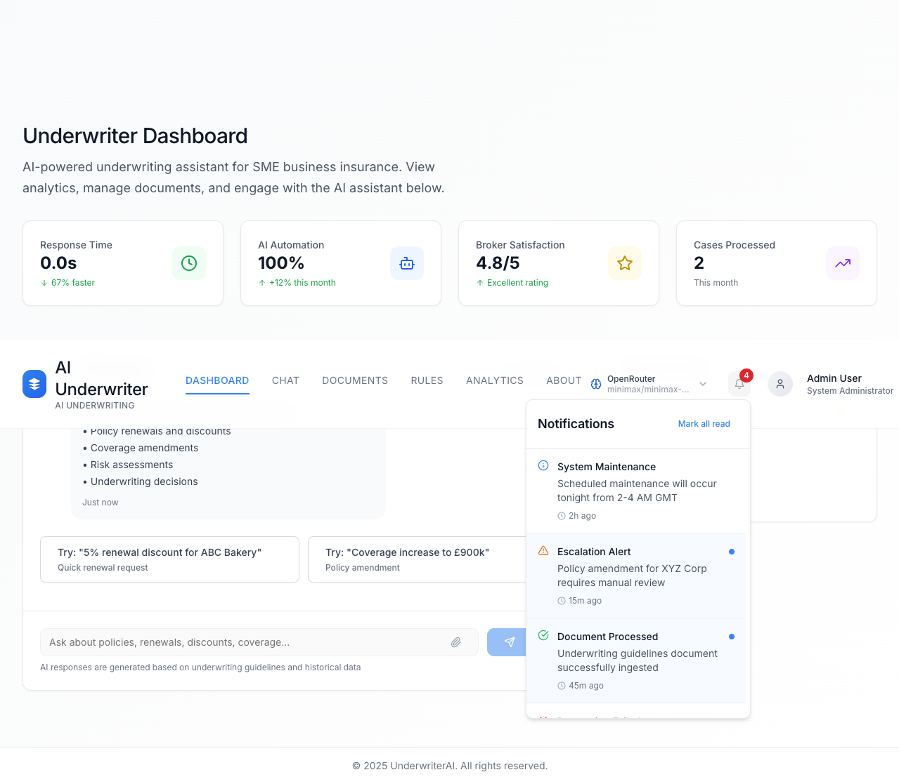

# 🤖 UnderwriterAI — Your AI Co-Pilot for SME Insurance Underwriting

> **Where brokers meet brainpower.** UnderwriterAI is a real-time, AI-native underwriting assistant that turns complex policy decisions into conversations. Built for SME insurance operations—by people who actually know what "excess" means.

---

## 🎬 See It in Action

| Dashboard | Smart Chat | Document Ingestion |
|-----------|-----------|---------------------|
|  |  |  |
| Real-time KPIs, AI stats & quick actions | Multi-provider AI chat with file upload | Bulk upload, processing & rule extraction |

| Rules Engine | Analytics Hub | Notifications |
|-----------|-----------|---------------|
|  |  |  |
| 51+ auto-extracted rules with confidence scores | Weekly volume, decision types & trend charts | Real-time alerts for escalations & system events |

---

## 🚀 What Makes It Tick

UnderwriterAI isn't another chatbot with an insurance costume. It's a **full-stack underwriting intelligence layer** that plugs into your broker workflow—from first question to final decision.

### ⚡ Lightning-Fast AI Decisions
Multi-provider AI support (Anthropic Claude, OpenAI GPT-4, Google Gemini) with **dynamic model switching** and **zero-config failover**. One API key or many—the assistant routes to the smartest brain for the job.

### 📄 Document → Rules in Seconds
Upload PDFs, Excel files, or policy wordings. UnderwriterAI **auto-extracts underwriting rules**, scores them by confidence, and makes them queryable via **semantic vector search**—no manual data entry required.

### 👥 Role-Based Everything
- **Admin** — Full system control, analytics, and rule governance
- **Standard User** — Day-to-day policy work with smart guardrails
- **External Broker** — Policy lookup, renewals, and chat-only access

Each role sees a **tailored UI** with permissions baked in at every layer.

### 📊 Live Analytics & Notifications
Broker satisfaction scores, response time trends, decision volume charts, and a **real-time notification bell** that keeps everyone in the loop—from system maintenance to escalation alerts.

---

## 🏗 Architecture at a Glance

```
┌─────────────────────────────────────┐
│  React + Vite + Tailwind CSS        │  ← Modern SPA frontend
│  • Radix UI primitives              │
│  • shadcn/ui components             │
│  • Real-time WebSocket chat         │
├─────────────────────────────────────┤
│  Express + TypeScript               │  ← API & routing layer
│  • JWT auth with role validation    │
│  • Multi-AI provider abstraction    │
│  • File upload & vector processing  │
├─────────────────────────────────────┤
│  SQLite + Drizzle ORM               │  ← Lightweight persistence
│  • Better-sqlite3 for performance   │
│  • Self-healing schema migrations   │
└─────────────────────────────────────┘
```

---

## 🛠 Getting Started

```bash
# Clone the repo
git clone https://github.com/praveenkay/UnderwriterAI.git
cd UnderwriterAI

# Install dependencies
npm install

# Configure environment
cp .env.example .env
# Add your OPENAI_API_KEY (or configure OpenRouter for free models)

# Start the dev server
npm run dev
```

The app runs on `http://localhost:5000` by default. Hit **Demo Access** on the login screen to explore without credentials.

---

## 🌟 Key Features

| Feature | What It Does |
|---------|-------------|
| **Multi-Provider AI Chat** | Claude, GPT-4, Gemini—switch on the fly |
| **Document Rule Extraction** | Auto-parse PDFs/Excel into structured rules |
| **Vector Semantic Search** | Find policies & clauses with natural language |
| **Bulk Document Operations** | Select, delete, and process files in batches |
| **Real-Time Notifications** | WebSocket alerts for escalations & updates |
| **Performance Analytics** | Charts, trend lines, and PDF report export |
| **Role-Based Access** | Admin / User / Broker with UI adaptation |
| **Decision History** | Full audit trail of every AI-made choice |

---

## 🎨 Design Philosophy

UnderwriterAI was built with a simple belief: **insurance professionals shouldn't wrestle with software.** Every pixel—from the clean dashboard cards to the chat's suggested prompts—was designed to reduce cognitive load and get brokers to "yes" faster.

- **Typography:** Inter for clarity at every size
- **Color:** Calm blues and confident greens (trust + growth)
- **Motion:** Subtle, purposeful animations that feel alive without slowing you down
- **Accessibility:** WCAG-compliant contrast and keyboard navigation throughout

---

## 🧪 Tech Stack

| Layer | Technology |
|-------|-----------|
| Frontend | React 18, Vite, Tailwind CSS, Radix UI, shadcn/ui |
| Backend | Express, TypeScript, tsx |
| Database | SQLite with Drizzle ORM |
| AI | Anthropic, OpenAI, Google Gemini via unified SDK |
| Auth | JWT with bcryptjs & role-based middleware |
| File Upload | Multer + ExcelJS for spreadsheet parsing |
| Vector Search | OpenAI Embeddings + custom vector store |

---

## 📜 License

MIT © 2025 UnderwriterAI

---

> *Built for underwriters who'd rather be underwriting.* ☕
